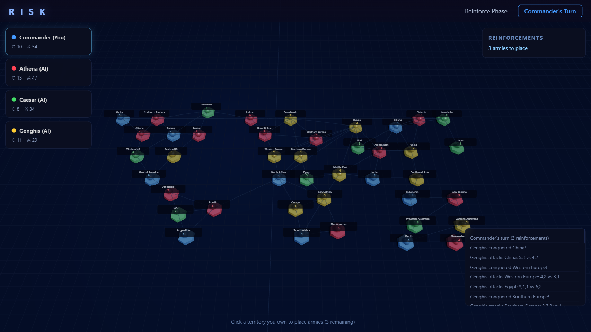

# Risk — Global Domination

A fully playable Risk board game in the browser using Three.js, with AI opponents (heuristic or LLM-powered).

## Features

- **3D board** — Three.js-rendered world map with 42 territories across 6 continents, colored hex markers, animated selection rings, and territory labels
- **Full Risk rules** — Claim → Reinforce → Attack → Fortify turn cycle, continent bonuses, dice combat with animated display, player elimination, win condition
- **1-5 AI opponents** — Built-in heuristic AI with Easy/Normal/Hard difficulty that reinforces borders, attacks with favorable odds, and fortifies weak spots
- **LLM integration** — Optional OpenAI-compatible API support (Ollama, LM Studio, vLLM, etc.) for AI decisions based on full game state

## Play

Open `index.html` in any modern browser. No build step or server required.

### LLM Opponents

1. Select **LLM Server** in setup
2. Point to your endpoint (default: `http://localhost:11434/v1/chat/completions` for Ollama)
3. Enter your model name

## Tech

- Pure HTML/CSS/JS single file
- Three.js for 3D rendering
- Canvas-based sprite labels
- No dependencies, no build tools

## License

MIT
