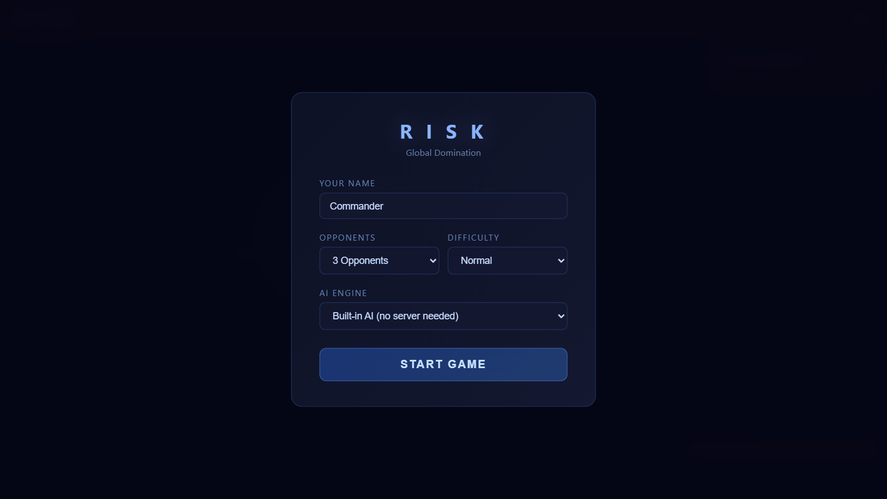
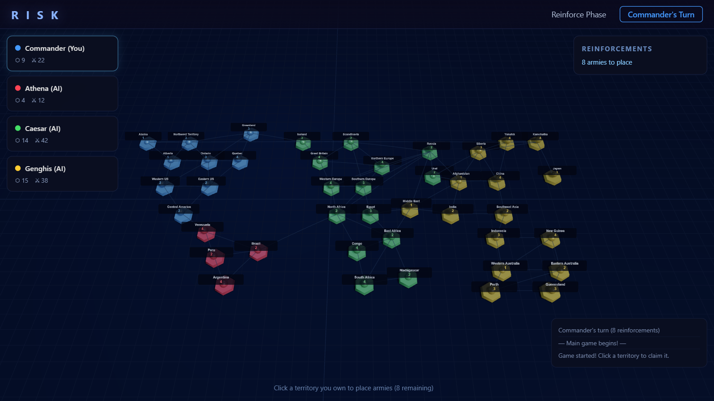
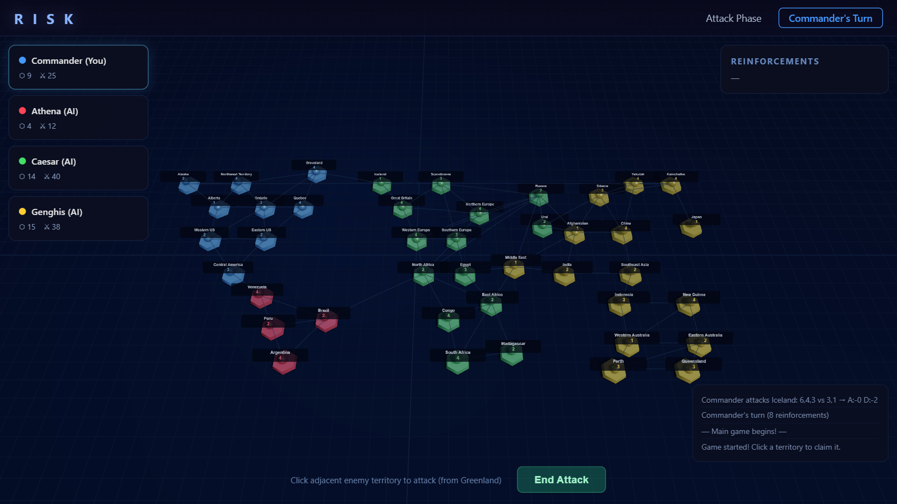

# 🎲 Risk — Global Domination

<div align="center">

**A fully playable Risk board game in the browser with 3D graphics and AI opponents**

[](https://djlougen.github.io/risk-game/)
[](LICENSE)
[](https://djlougen.github.io/risk-game/)


</div>

---

## ✨ Features

### 🎮 Full Risk Gameplay
- **42 territories** across 6 continents with proper adjacency
- **Complete turn cycle**: Claim → Reinforce → Attack → Fortify
- **Continent bonuses**: Strategic value for controlling entire regions
- **Dice combat**: Animated dice rolls with proper Risk battle rules
- **Player elimination**: Conquer opponents to win
- **Victory condition**: Dominate the world

### 🌍 3D Board
- **Three.js rendering**: Beautiful 3D world map with colored hex markers
- **Animated selection**: Glowing rings show selected territories
- **Dynamic labels**: Territory names and army counts rendered as sprites
- **Color-coded players**: Clear visual distinction between opponents

### 🤖 AI Opponents
- **1-5 AI players** with three difficulty levels (Easy/Normal/Hard)
- **Strategic AI**: 
  - Reinforces border territories
  - Attacks with favorable odds (3:1 or better)
  - Fortifies weak positions
  - Prioritizes continent control
- **Heuristic-based**: No server required, runs entirely in-browser

### 🧠 LLM Integration (Optional)
- **OpenAI-compatible API support**: Works with Ollama, LM Studio, vLLM, or any compatible endpoint
- **Context-aware decisions**: Sends full game state as JSON to the LLM
- **Graceful fallback**: Reverts to heuristic AI on errors or timeouts
- **Flexible configuration**: Custom endpoint and model selection

---

## 🚀 Play Now

**[▶ Play Online](https://djlougen.github.io/risk-game/)** — No installation required!

Or play locally:

```bash
git clone https://github.com/DJLougen/risk-game.git
cd risk-game
# Open index.html in your browser
```

---

## 📖 How to Play

### 1. Setup
- Enter your name and choose number of opponents (1-5)
- Select AI difficulty (Easy/Normal/Hard)
- Optional: Enable LLM mode and configure API endpoint

### 2. Claim Territories
- Click unclaimed territories to claim them (1 army each)
- Players take turns until all 42 territories are claimed

### 3. Place Reinforcements
- Click your territories to add armies
- Number of armies based on territories owned and continent bonuses

### 4. Attack
- Click your territory (2+ armies) → Click adjacent enemy territory
- Choose how many armies to attack with
- Watch the dice roll and see if you conquer the territory!

### 5. Fortify
- Click your territory → Click connected friendly territory
- Move armies to strengthen your position

### 6. Win
- Eliminate all other players to achieve global domination!

---

## 🎯 Screenshots

<div align="center">

### Setup Screen


### Gameplay


### Combat


</div>

---

## 🧠 Using LLM Opponents

### With Ollama (Local)

1. Install [Ollama](https://ollama.ai/)
2. Pull a model: `ollama pull llama3.2`
3. Start Ollama: `ollama serve`
4. In game setup:
   - Select **LLM Server** mode
   - Endpoint: `http://localhost:11434/v1/chat/completions`
   - Model: `llama3.2` (or your preferred model)

### With Other Services

Any OpenAI-compatible API works:

- **LM Studio**: `http://localhost:1234/v1/chat/completions`
- **vLLM**: Your vLLM server endpoint
- **Custom**: Any server implementing the OpenAI chat completions format

### API Format

The game sends a JSON payload with:
- Current game state (territories, armies, players)
- Available actions for the current phase
- Strategic context and objectives

The LLM responds with structured move decisions.

---

## 🛠️ Technical Details

### Stack
- **Pure HTML/CSS/JavaScript** — Single file, no build step
- **Three.js** — 3D rendering engine
- **Canvas API** — Sprite-based territory labels
- **No dependencies** — Zero npm packages required

### Architecture
- **Game State Management**: Central `G` object tracks all game state
- **Turn System**: State machine with phases (claim/reinforce/attack/fortify)
- **AI Engine**: Heuristic scoring functions for strategic decisions
- **LLM Adapter**: HTTP client with timeout and error handling
- **Renderer**: Three.js scene with camera controls and animations

### Performance
- Runs at 60 FPS on modern browsers
- Efficient adjacency lookups (precomputed)
- Minimal DOM updates (only on state changes)

---

## 🤝 Contributing

Contributions welcome! Some ideas:

- **Save/Load**: Persist game state to localStorage
- **Multiplayer**: WebSocket-based real-time play
- **More AI personalities**: Different strategic approaches
- **Sound effects**: Dice rolls, combat, victory
- **Mobile controls**: Touch-friendly interface
- **Replay system**: Record and playback games

### Development

```bash
git clone https://github.com/DJLougen/risk-game.git
cd risk-game
# Edit index.html directly
# Open in browser to test
```

---

## 📜 License

MIT License - see [LICENSE](LICENSE) for details.

---

## 🙏 Acknowledgments

- Risk board game by Hasbro
- Three.js for 3D rendering
- The open-source AI community

---

<div align="center">

**[▶ Play Now](https://djlougen.github.io/risk-game/)** • **[Report Bug](https://github.com/DJLougen/risk-game/issues)** • **[Request Feature](https://github.com/DJLougen/risk-game/issues)**

Made with 🎲 and ☕

</div>
